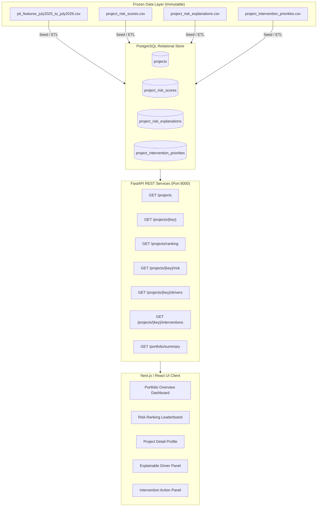

# Module 4 — Phase 8: Team Handoff Specification

**Project**: SIH26103 — PAIMANA Predictive Risk Intelligence  
**Document Type**: Cross-Functional Engineering Handoff  
**Target Audiences**: Frontend UI/UX, Backend API, Relational Database, Data/ML, Product & Pitch Teams  
**Status**: Frozen Specification  
**Date**: September 2026  

---

## 1. System Architecture Overview

The PAIMANA architecture connects the frozen Python/scikit-learn predictive modeling pipeline with enterprise client applications through a secure, high-performance RESTful API.



---

## 2. Database Specification (4 Core Entities)

The database team must provision the following relational schema in PostgreSQL 15+. All tables enforce foreign keys pointing to `projects(canonical_project_key)`.

### 2.1 Table 1: `projects`
Stores canonical point-in-time project identity and baseline descriptive metadata.
```sql
CREATE TABLE projects (
    canonical_project_key VARCHAR(64) PRIMARY KEY,
    source_project_id INTEGER NOT NULL,
    project_name TEXT NOT NULL,
    state VARCHAR(128) NOT NULL,
    agency VARCHAR(128) NOT NULL,
    original_cost_crore NUMERIC(12, 2) NOT NULL,
    cumulative_expenditure_crore NUMERIC(12, 2) NOT NULL,
    expenditure_ratio NUMERIC(8, 4) NOT NULL,
    physical_progress_pct NUMERIC(5, 2) NOT NULL,
    divergence NUMERIC(8, 4) NOT NULL,
    project_age_months NUMERIC(8, 2) NOT NULL,
    remaining_duration_months NUMERIC(8, 2),
    snapshot_date DATE NOT NULL DEFAULT '2025-07-01',
    created_at TIMESTAMP WITH TIME ZONE DEFAULT CURRENT_TIMESTAMP
);

CREATE INDEX idx_projects_state ON projects(state);
CREATE INDEX idx_projects_agency ON projects(agency);
```

### 2.2 Table 2: `project_risk_scores`
Stores multi-hazard probability estimates, coverage flags, attention scores, and portfolio ranks.
```sql
CREATE TABLE project_risk_scores (
    canonical_project_key VARCHAR(64) PRIMARY KEY REFERENCES projects(canonical_project_key) ON DELETE CASCADE,
    source_project_id INTEGER NOT NULL,
    project_name TEXT NOT NULL,
    state VARCHAR(128) NOT NULL,
    agency VARCHAR(128) NOT NULL,
    snapshot_date DATE NOT NULL,
    prediction_cutoff_date DATE NOT NULL,
    is_eligible_cost_target SMALLINT NOT NULL CHECK (is_eligible_cost_target IN (0, 1)),
    is_eligible_schedule_target SMALLINT NOT NULL CHECK (is_eligible_schedule_target IN (0, 1)),
    cost_risk_probability NUMERIC(6, 4) NOT NULL CHECK (cost_risk_probability >= 0.0 AND cost_risk_probability <= 1.0),
    schedule_risk_probability NUMERIC(6, 4) CHECK (schedule_risk_probability >= 0.0 AND schedule_risk_probability <= 1.0),
    risk_coverage VARCHAR(16) NOT NULL CHECK (risk_coverage IN ('FULL', 'PARTIAL')),
    attention_score NUMERIC(6, 4) NOT NULL CHECK (attention_score >= 0.0 AND attention_score <= 1.0),
    compound_exposure NUMERIC(6, 4) CHECK (compound_exposure >= 0.0 AND compound_exposure <= 1.0),
    attention_tier VARCHAR(16) NOT NULL CHECK (attention_tier IN ('Tier 1', 'Tier 2', 'Tier 3', 'Tier 4')),
    portfolio_rank INTEGER NOT NULL CHECK (portfolio_rank >= 1),
    cost_model_name VARCHAR(64) NOT NULL,
    schedule_model_name VARCHAR(64) NOT NULL,
    cost_probability_variant VARCHAR(32) NOT NULL,
    schedule_probability_variant VARCHAR(32) NOT NULL,
    scoring_method_version VARCHAR(32) NOT NULL,
    created_at TIMESTAMP WITH TIME ZONE DEFAULT CURRENT_TIMESTAMP
);

CREATE INDEX idx_risk_scores_tier ON project_risk_scores(attention_tier);
CREATE INDEX idx_risk_scores_rank ON project_risk_scores(portfolio_rank);
CREATE INDEX idx_risk_scores_attention ON project_risk_scores(attention_score DESC);

> [!IMPORTANT]
> **Backend Serialization & Normalization Contract**:
> - **Physical CSV / Database Representation**: In the frozen dataset `data/processed/project_risk_scores.csv` and relational table `project_risk_scores`, `cost_probability_variant` and `schedule_probability_variant` are stored as `"Raw / Uncalibrated"`.
> - **REST / API Representation**: The backend FastAPI / REST serialization layer MUST normalize this representation at the API boundary to lowercase snake_case: `"raw_uncalibrated"`.
> - **Rule**: The backend must perform this mapping dynamically during serialization (e.g., via Pydantic model validator or ORM serializer). Do NOT modify the underlying frozen CSV artifact.
```

### 2.3 Table 3: `project_risk_explanations`
Stores top 3 local feature drivers and observed source facts per task ($N=874$ rows).
```sql
CREATE TABLE project_risk_explanations (
    explanation_id BIGSERIAL PRIMARY KEY,
    canonical_project_key VARCHAR(64) NOT NULL REFERENCES projects(canonical_project_key) ON DELETE CASCADE,
    source_project_id INTEGER NOT NULL,
    project_name TEXT NOT NULL,
    state VARCHAR(128) NOT NULL,
    agency VARCHAR(128) NOT NULL,
    task VARCHAR(32) NOT NULL CHECK (task IN ('cost_overrun', 'schedule_slippage')),
    is_eligible_task_target SMALLINT NOT NULL CHECK (is_eligible_task_target IN (0, 1)),
    predicted_risk_probability NUMERIC(6, 4),
    attention_score NUMERIC(6, 4) NOT NULL,
    attention_tier VARCHAR(16) NOT NULL,
    portfolio_rank INTEGER NOT NULL,
    risk_coverage VARCHAR(16) NOT NULL,
    top_1_feature VARCHAR(64),
    top_1_feature_value NUMERIC(12, 4),
    top_1_impact NUMERIC(10, 6),
    top_1_direction VARCHAR(20) CHECK (top_1_direction IN ('INCREASES_RISK', 'DECREASES_RISK', 'NEUTRAL')),
    top_1_source_fact TEXT,
    top_2_feature VARCHAR(64),
    top_2_feature_value NUMERIC(12, 4),
    top_2_impact NUMERIC(10, 6),
    top_2_direction VARCHAR(20) CHECK (top_2_direction IN ('INCREASES_RISK', 'DECREASES_RISK', 'NEUTRAL')),
    top_2_source_fact TEXT,
    top_3_feature VARCHAR(64),
    top_3_feature_value NUMERIC(12, 4),
    top_3_impact NUMERIC(10, 6),
    top_3_direction VARCHAR(20) CHECK (top_3_direction IN ('INCREASES_RISK', 'DECREASES_RISK', 'NEUTRAL')),
    top_3_source_fact TEXT,
    explanation_method VARCHAR(64) NOT NULL,
    explanation_disclaimer TEXT NOT NULL,
    CONSTRAINT uq_proj_task UNIQUE (canonical_project_key, task)
);

CREATE INDEX idx_explanations_proj_task ON project_risk_explanations(canonical_project_key, task);
```

### 2.4 Table 4: `project_intervention_priorities`
Stores operational action assignments, evidence linkages, and data completeness indicators.
```sql
CREATE TABLE project_intervention_priorities (
    canonical_project_key VARCHAR(64) PRIMARY KEY REFERENCES projects(canonical_project_key) ON DELETE CASCADE,
    cost_risk_probability NUMERIC(6, 4) NOT NULL,
    schedule_risk_probability NUMERIC(6, 4),
    attention_score NUMERIC(6, 4) NOT NULL,
    risk_coverage VARCHAR(16) NOT NULL,
    portfolio_rank INTEGER NOT NULL,
    intervention_priority VARCHAR(16) NOT NULL CHECK (intervention_priority IN ('PRIORITY_1', 'PRIORITY_2', 'PRIORITY_3', 'PRIORITY_4')),
    primary_action TEXT NOT NULL,
    secondary_action TEXT NOT NULL,
    risk_focus VARCHAR(32) NOT NULL,
    priority_reason TEXT NOT NULL,
    evidence_feature VARCHAR(64) NOT NULL,
    evidence_value NUMERIC(12, 4) NOT NULL,
    evidence_direction VARCHAR(20) NOT NULL,
    data_quality_flag VARCHAR(32) NOT NULL CHECK (data_quality_flag IN ('COMPLETE_BASELINE_DATA', 'SCHEDULE_OUTCOME_UNOBSERVED', 'MISSING_APPROVAL_DATE')),
    governance_note TEXT NOT NULL,
    created_at TIMESTAMP WITH TIME ZONE DEFAULT CURRENT_TIMESTAMP
);

CREATE INDEX idx_interventions_priority ON project_intervention_priorities(intervention_priority);
CREATE INDEX idx_interventions_action ON project_intervention_priorities(primary_action);
```

---

## 3. Backend API Specification (7 REST Endpoints)

The backend must be implemented using FastAPI (Python) or Express/NestJS (TypeScript). All endpoints return standard JSON payloads.

> [!NOTE]
> **Field Normalization Note**: The backend is responsible for normalizing physical storage representations to API contract formats. Specifically, the frozen CSV stores probability variants as `"Raw / Uncalibrated"`, which the backend must normalize and serialize to `"raw_uncalibrated"` in all REST responses. Do not modify the underlying frozen CSV artifact.

### Endpoint 1: `GET /projects`
* **Description**: Retrieve a paginated list of projects with high-level risk and intervention summary.
* **Query Parameters**:
  - `page` (int, default: 1): Page number.
  - `page_size` (int, default: 20, max: 100): Records per page.
  - `state` (string, optional): Filter by state.
  - `agency` (string, optional): Filter by agency.
  - `tier` (string, optional): Filter by `Tier 1`, `Tier 2`, `Tier 3`, `Tier 4`.
  - `coverage` (string, optional): Filter by `FULL` or `PARTIAL`.
* **Response Status**: `200 OK`
* **Response Body Schema**:
```json
{
  "total_records": 437,
  "page": 1,
  "page_size": 20,
  "total_pages": 22,
  "data": [
    {
      "canonical_project_key": "proj_16723_02b9f3d9",
      "source_project_id": 16723,
      "project_name": "LALITPUR-SATNA-REWA-SINGRULI NL",
      "state": "Madhya Pradesh",
      "agency": "WEST CENTRAL RAILWAY",
      "attention_score": 0.9980,
      "attention_tier": "Tier 1",
      "portfolio_rank": 1,
      "risk_coverage": "FULL",
      "cost_risk_probability": 0.9980,
      "schedule_risk_probability": 0.9700,
      "intervention_priority": "PRIORITY_1",
      "primary_action": "JOINT_COST_SCHEDULE_REVIEW"
    }
  ]
}
```

### Endpoint 2: `GET /projects/{canonical_project_key}`
* **Description**: Comprehensive single-project profile combining metadata, risk scores, explanations, and intervention priority.
* **Path Parameter**: `canonical_project_key` (string).
* **Response Status**: `200 OK` (or `404 Not Found`).
* **Response Body Schema**:
```json
{
  "project": {
    "canonical_project_key": "proj_16723_02b9f3d9",
    "source_project_id": 16723,
    "project_name": "LALITPUR-SATNA-REWA-SINGRULI NL",
    "state": "Madhya Pradesh",
    "agency": "WEST CENTRAL RAILWAY",
    "original_cost_crore": 247.66,
    "cumulative_expenditure_crore": 5214.37,
    "physical_progress_pct": 58.0,
    "divergence": 20.47,
    "project_age_months": 322.0
  },
  "risk": {
    "attention_score": 0.9980,
    "portfolio_rank": 1,
    "attention_tier": "Tier 1",
    "risk_coverage": "FULL",
    "cost_risk_probability": 0.9980,
    "schedule_risk_probability": 0.9700,
    "compound_exposure": 0.9700,
    "models": {
      "cost_model": "RandomForestClassifier (raw_uncalibrated)",
      "schedule_model": "RandomForestClassifier (raw_uncalibrated)"
    }
  },
  "intervention": {
    "priority": "PRIORITY_1",
    "primary_action": "JOINT_COST_SCHEDULE_REVIEW",
    "secondary_action": "PROGRESS_VERIFICATION",
    "risk_focus": "JOINT_COST_SCHEDULE",
    "priority_reason": "High joint cost and schedule risk. Divergence 20.47 indicates expenditure outpacing physical progress.",
    "evidence_feature": "feat_physical_vs_financial_divergence",
    "evidence_value": 20.47,
    "data_quality_flag": "COMPLETE_BASELINE_DATA",
    "governance_note": "Intervention advisory protocol only. Automated sanctions or budget freezes are strictly prohibited."
  }
}
```

### Endpoint 3: `GET /projects/ranking`
* **Description**: Portfolio ranking table ordered strictly by `portfolio_rank` ascending.
* **Query Parameters**:
  - `limit` (int, default: 50): Number of rows.
  - `offset` (int, default: 0): Offset.
  - `tier` (string, optional): Filter by attention tier.
* **Response Status**: `200 OK`.

### Endpoint 4: `GET /projects/{canonical_project_key}/risk`
* **Description**: Detailed risk evaluation metrics, including cost probability, schedule probability, attention score, compound exposure, and eligibility flags.
* **Response Status**: `200 OK`.

### Endpoint 5: `GET /projects/{canonical_project_key}/drivers`
* **Description**: Explainable risk drivers for the project across both cost and schedule tasks.
* **Response Status**: `200 OK`.
* **Response Body Schema**:
```json
{
  "canonical_project_key": "proj_16723_02b9f3d9",
  "cost_drivers": {
    "task": "cost_overrun",
    "is_eligible": 1,
    "probability": 0.9980,
    "top_drivers": [
      {
        "rank": 1,
        "feature": "feat_physical_vs_financial_divergence",
        "value": 20.47,
        "impact": 0.1245,
        "direction": "INCREASES_RISK",
        "source_fact": "Expenditure ratio (21.05) exceeds physical progress (58.00%) by 20.47 divergence index."
      }
    ]
  },
  "schedule_drivers": {
    "task": "schedule_slippage",
    "is_eligible": 1,
    "probability": 0.9700,
    "top_drivers": [ ... ]
  },
  "disclaimer": "Feature attributions reflect statistical associations in historical MoSPI snapshots; they do not establish causal fault or contractor liability."
}
```

### Endpoint 6: `GET /projects/{canonical_project_key}/interventions`
* **Description**: Complete intervention profile with action steps, priority reasons, evidence groundings, and governance disclaimers.
* **Response Status**: `200 OK`.

### Endpoint 7: `GET /portfolio/summary`
* **Description**: High-level portfolio aggregates for executive monitoring dashboards.
* **Response Status**: `200 OK`.
* **Response Body Schema**:
```json
{
  "total_projects": 437,
  "coverage_breakdown": {
    "full_coverage": 305,
    "partial_coverage": 132
  },
  "tier_distribution": {
    "Tier 1": 44,
    "Tier 2": 73,
    "Tier 3": 102,
    "Tier 4": 218
  },
  "intervention_priority_distribution": {
    "PRIORITY_1": 44,
    "PRIORITY_2": 73,
    "PRIORITY_3": 102,
    "PRIORITY_4": 218
  },
  "action_distribution": {
    "DATA_QUALITY_REVIEW": 128,
    "JOINT_COST_SCHEDULE_REVIEW": 90,
    "SCHEDULE_REVIEW": 81,
    "COMPLETION_STATUS_REVIEW": 79,
    "COST_REVIEW": 29,
    "PROGRESS_VERIFICATION": 24,
    "EXPENDITURE_PROGRESS_REVIEW": 6
  },
  "risk_focus_distribution": {
    "SCHEDULE_RISK": 159,
    "UNOBSERVED_SCHEDULE": 128,
    "JOINT_COST_SCHEDULE": 90,
    "COST_RISK": 29,
    "BASELINE_MONITORING": 24,
    "PROGRESS_FINANCIAL_DIVERGENCE": 6,
    "COMPLETION_STATUS": 1
  }
}
```

---

## 4. Frontend UI/UX Specification (5 Core Screens & Components)

Frontend engineers must build the following five components using React/Next.js and Tailwind CSS (or equivalent component library).

### 4.1 Screen 1: Portfolio Overview Dashboard
* **Header KPI Cards**:
  - Total Active Monitored Assets: `437`
  - Tier 1 Priority Assets: `44` (90th Percentile)
  - Full Coverage Assets: `305` (70%)
  - Partial Coverage Assets (Missing Schedule Baseline): `132` (30%)
* **Visualizations**:
  - Attention Score Distribution Bar Chart (Tier 1 vs 2 vs 3 vs 4).
  - Primary Action Donut Chart (Data Quality Review vs Joint Review vs Schedule Review etc.).
  - Top Agencies by Tier 1 Attention (Horizontal bar chart).

### 4.2 Screen 2: Risk Ranking Table (Leaderboard)
* **Table Columns**:
  - `Rank` (#1 to #419)
  - `Project Name` (Clickable $	o$ navigates to Project Detail)
  - `Agency` & `State`
  - `Coverage` (Badge: Blue `FULL`, Amber `PARTIAL`)
  - `Cost Risk` (Formatted %: e.g. `99.8%`)
  - `Schedule Risk` (Formatted %: e.g. `97.0%` or italic gray `Unobserved`)
  - `Attention Score` (Formatted % with color intensity)
  - `Tier` (Badge: Red `Tier 1`, Orange `Tier 2`, Yellow `Tier 3`, Slate `Tier 4`)
  - `Action` (Primary action badge)
* **Controls**: Search input by project name or ID, multi-select dropdown for Agency/State, radio toggle for Coverage, quick filter buttons for Tiers.

### 4.3 Screen 3: Project Detail Profile
* **Header**: Project Name, Agency, State, Sanctioned Baseline Cost, Cumulative Expenditure, Recorded Physical Progress.
* **Multi-Hazard Risk Cards**:
  - Card 1: **Cost Overrun Risk (>5%)**: Probability meter, model architecture badge, task eligibility tag.
  - Card 2: **Schedule Slippage Risk (>=3 months)**:
    - If `FULL`: Probability meter and model tag.
    - If `PARTIAL`: Warning banner *"Schedule Outcome Unobserved: Baseline milestone dates missing in source reporting. Cost risk used as sole attention score."*
  - Card 3: **Compound Exposure**:
    - If `FULL`: Gauge displaying concurrent risk. Footnote: *"Non-joint heuristic indicator."*
    - If `PARTIAL`: Grayed out with *"Not Available for Partial Coverage"*.

### 4.4 Screen 4: Explainable Risk Drivers Panel
* Two tabbed or side-by-side sections: **Cost Risk Drivers** and **Schedule Risk Drivers**.
* For each driver (Rank 1, 2, 3):
  - Driver title (e.g. `Physical vs Financial Outlay Divergence`)
  - Impact badge (`Increases Attention` in red, `Decreases Attention` in green)
  - Observed Source Fact callout box (e.g. *“Expenditure ratio (21.05) exceeds physical progress (58.00%) by 20.47 divergence index.”*)
* Persistent disclaimer banner at the base of the panel.

### 4.5 Screen 5: Intervention Action Panel
* **Priority Header**: Prominent badge: `PRIORITY_1 (14-day review recommended)`.
* **Action Directives**:
  - Primary Action card with detailed protocol checklist.
  - Secondary Action card with follow-up milestones.
* **Evidence Grounding Card**: Shows the exact feature and value that triggered the recommendation rule.
* **Governance Notice**: Prominently framed box:
  > **Official MoSPI Surveillance Protocol**: *This recommendation is an analytical aid for supervisory teams. It does not constitute a disciplinary determination, budget sanction, or legal finding.*

---

## 5. Product & Pitch Team Guidelines (Safe vs Unsafe Claims)

For hackathon presentations, jury demos, and executive slide decks, team members MUST strictly adhere to the following communication guidelines:

| Safe & Defensible Claims (Say This) | Prohibited & Unsound Claims (Do NOT Say This) |
| :--- | :--- |
| "PAIMANA identifies infrastructure projects showing high statistical vulnerability to cost overruns or schedule delays." | "PAIMANA predicts with 100% certainty which contractor will fail." |
| "The system uses prospective point-in-time features to prioritize executive monitoring attention across 437 central projects." | "The AI detects corrupt agencies or fraudulent contractors." |
| "Attention scores aggregate independent prospective hazard probabilities into operational focus tiers." | "The system computes the exact joint mathematical probability of simultaneous failure." |
| "Our explainability layer surfaces observed historical data facts to explain why the model flagged the asset." | "The model proves the root cause of why the project was delayed." |
| "Projects missing baseline milestone dates are explicitly flagged as Partial Coverage to prevent hidden blind spots." | "Projects with missing data are assumed to have zero schedule risk." |
| "Recommendations guide technical field audits and milestone reviews to assist human project directors." | "The system automatically cuts budgets, cancels tenders, or penalizes agencies." |
